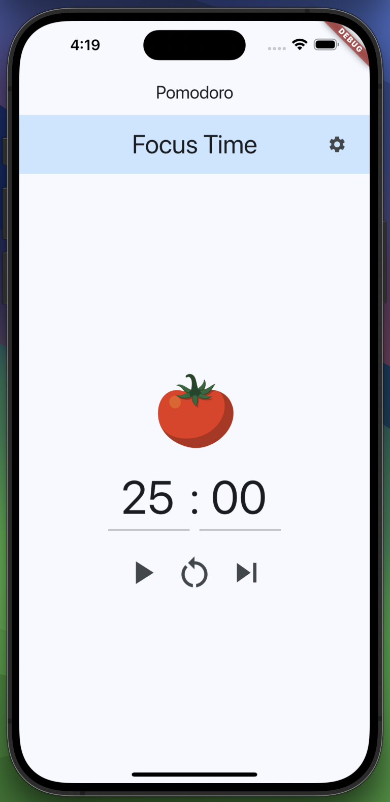

# Privacy Policy

This app does not track any data. The app is purely built and ran on the devices, with 0 server-side processing or storing of data.

# Pomodoro

A productivity app used to focus on tasks and prevent distractions. 

My first ever app built using Flutter and Dart, and tested using my iOS.

## Features to add

- [X] Add prettier icons
- [X] Make time customizable
- [X] Send a notification / sound-effect when each timer finishes
- [X] Merge play / pause button
- [ ] Resolve issue about changing time for a focus / break session not reflecting subsequent initialFocusTime or initialBreakTime.

## Useful Links
- https://medium.com/front-end-weekly/how-to-test-your-flutter-ios-app-on-your-ios-device-75924bfd75a8

## Journal 

### Aug 26, 2024

I'm trying to find the balance between using ChatGPT to help me learn how to use Dart / Flutter and using the Docs. So far, both have been very helpful - the Docs for going in depth on a topic for my own learning (e.g., managing state using things like ChangeNotifiers, Themes and Material Design), and ChatGPT has been helpful as a coding assistant. I recently copy/pasted my main.dart into ChatGPT and pointed out a line that was causing an error (involving using the player to play a sound), and it neatly broke down the problem and told me what to do to fix it. I reviewed the code it gave me, made sure I understood where I went wrong, and applied the changes. So far, so good!

### Aug 29, 2024

Now that the functionality is becoming a bit more complex for this simple utility app, I'm starting to wonder if I should spend more time attempting to figure out 'best practise' ways to approach it. My knowledge of front-end development is lacking, and I'm really tackling this head-on and addressing challenges as they come up. There was a fireship course I'm considering taking a look at to potentially fill in the blanks - it would be good to learn about new tools within Flutter / Dart, and learn more about the underlying framework that makes everything possible. We'll see. 

### Aug 30, 2024

AI has really been helping me build this app so quickly. I'm using Claude, and I'm able to upload my main.dart file, prompt it to add a new UI component (I did this with the banner), and it spits out some good code that I can actually use. Sometimes the code or layout isn't quite what I wanted, so I'll explain this to Claude and it'll correct itself. Throughout all of this, I'm taking extra care to understand everything I use it for - I don't want to let myself get to the point where I'm mindlessly copy pasting the code it provides me with without vetting it and understanding it first. It's a tool to help speed up my workflow, but it still requires an understanding of what the code does along with some minor tweaking of the cod whenever necessary.

I used AI to generate the little tomato logo as well, really nifty!

### Sep 9, 2024

Think I'm about done with this app, it's pretty functional at this point. I think I could have designed things better - there were especially some awkward bits with having the timer duration update whenever changing the settings page - I had to incorporate a RouteAware mixin, and bring in an extra dependency, and I feel like it would have been unnecessary if I designed the app a bit better.

AI has of course been such a momentous help to me, but there's a danger of using it as a crutch and having a hollow understanding of what the program is actually doing. I'm currently of the opinion that it is a great timesaver and allows you to develop at a much faster pace, but should be used cautiously, and you should never copy-paste without understanding what the code does. This, of course, applies to stack overflow as much as it does AI. I've really been using AI as a shorthand way to google things, but with the tradeoff of less ability to scrutinize the source.

 Next up, figuring out how to ship this thing on iOS and Android!
